# v2b_syndata: Synthetic data for Vehicle-to-Building research

`v2b_syndata` is a parameter-driven synthetic-data generator for
Vehicle-to-Building (V2B) studies. It emits the seven CSVs that a downstream
control / market / optimization study consumes — building load, EV fleet,
users, chargers, sessions, grid prices, and demand-response events — from a
single scenario descriptor, with bitwise-reproducible seeding and a fully
audited knob surface.

This document is the showcase narrative. It is paired with three pre-generated
example scenarios in `data/example_scenarios/`, a Marp slide deck under
`slides/`, and an exploration notebook under `notebooks/`.

---

## 1. The problem

V2B research sits at the intersection of buildings, vehicles, users, equipment,
tariffs, and grid-side events. Empirical datasets that span all six are rare,
non-public, or partial. Without them, comparisons across papers become apples
to oranges: each group calibrates against whatever traces happen to be
available, and the conclusions float. Figure 01 places `v2b_syndata` against
that landscape.

### Figure 1 — The data-availability landscape for V2B

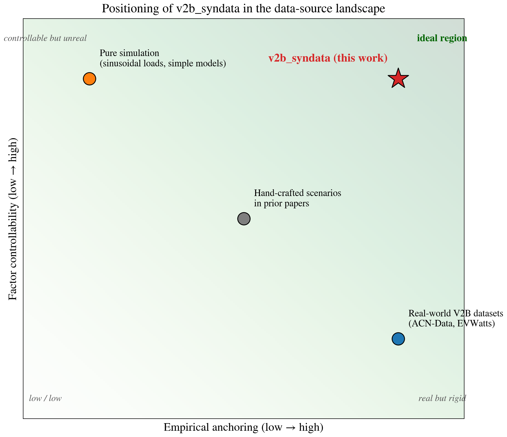

`v2b_syndata` does not claim to *replace* empirical traces. It claims that
when six factors must be co-varied in a controlled experiment, a generator
with audited knobs and reproducible seeds is the right substrate. Real traces
calibrate the marginals; the generator combines them.

---

## 2. What it produces

A single scenario resolves to seven CSVs plus a `manifest.json` recording the
resolved knob values, seed lineage, and per-CSV SHA-256 hashes. Figure 02
shows the schemas; Figure 03 excerpts a manifest.

### Table 1 — CSV schema

| CSV | Rows (typical) | Key columns | What it represents |
|---|---|---|---|
| building_load.csv | ~2700/month | datetime, power_flex_kw, power_inflex_kw | Building electrical demand split into HVAC (flex) and lighting+equipment (inflex) |
| cars.csv | 20–50 | car_id, capacity_kwh, battery_class | EV fleet composition |
| users.csv | 20–50 | car_id, region, phi, kappa, delta_km, w1, w2 | User behavioral parameters |
| chargers.csv | 1–100 | charger_id, directionality, max_rate_kw | Charging infrastructure |
| sessions.csv | ~300–800 | car_id, arrival, departure, arrival_soc, required_soc_at_depart | Per-session charging requests |
| grid_prices.csv | ~2700/month | datetime, price_per_kwh, type | Tariff schedule |
| dr_events.csv | 0–N | event_id, start, end, magnitude_kw, notified_at | Demand response events |

### Figure 2 — CSV schemas at a glance

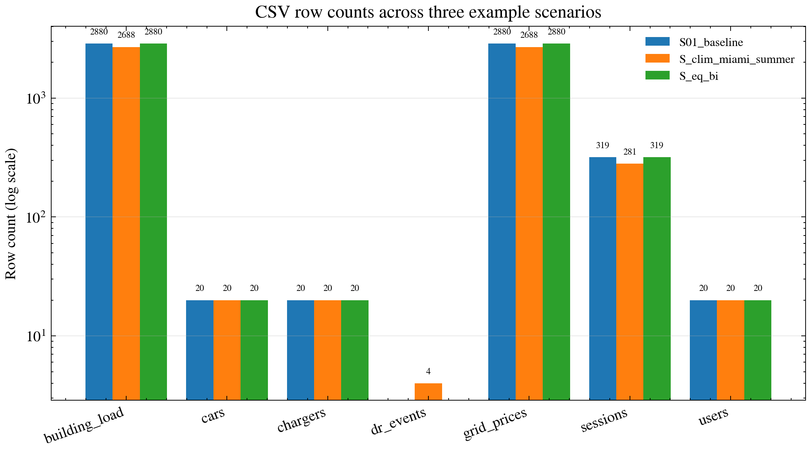

### Figure 3 — Manifest excerpt

The manifest pins every resolved knob, the seed lineage, and a per-CSV
SHA-256. Identical manifests imply identical outputs.

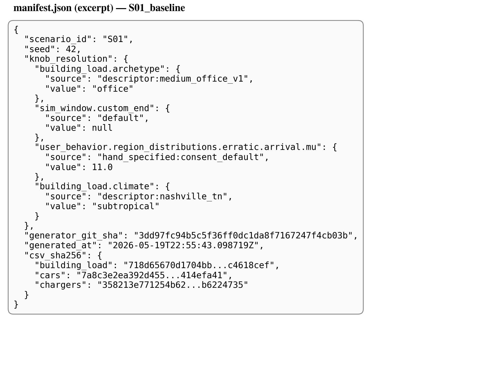

---

## 3. The factor space

Scenarios are not free-form: they are points in a structured factor space.
The user-population side is parameterized by a low-dimensional descriptor
(Figure 04); the full knob surface partitions into buckets that map cleanly
to the V2B factors (Figure 05). Table 2 lists the experiments built on this
space.

### Figure 4 — Population descriptor model

The behavioral state of a population is captured by descriptors such as
willingness ψ, region-mix, and per-user dispersion. Figure 04 shows how
descriptors compose into a calibrated session generator.

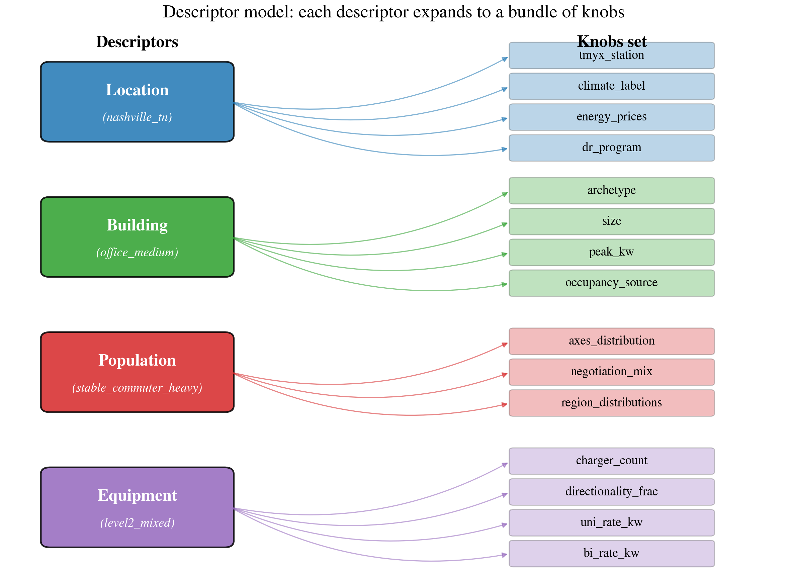

### Figure 5 — Knob buckets

98 knobs partition into population, building, equipment, tariff, DR, climate,
seed/noise. Each bucket has an independent audit (§7).

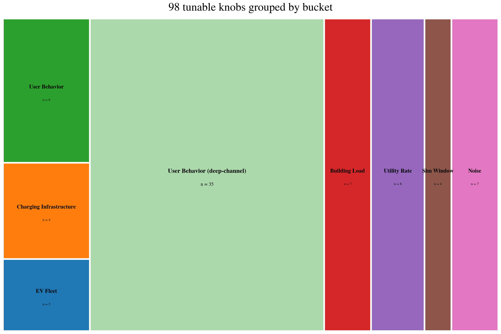

### Table 2 — Experiment / knob matrix

| Experiment | Knobs swept | Scenarios |
|---|---|---|
| E1 ψ-monotonicity | population descriptors | 5 (S_psi_010..090) |
| E2 rate structure | tariff_type, energy_prices, demand_charge | 3 (+S01) |
| E3 DR programs | dr_program, magnitude, lead time | 3 |
| E4 equipment | directionality_frac, rates | 2 (+S01) |
| E5 CONSENT | min_depart_soc, w_multiplier, f_soc | 4 (+S01) |
| E6 building | building_load.archetype, size | 3 (+S01) |
| E8 climate × season | location × sim_window | 20 |

---

## 4. Architecture

The pipeline is a four-tier resolution chain: configuration → descriptors →
samplers → CSVs. Figure 06 shows the tiers; Figure 07 shows the Bayesian-style
DAG over the random variables; Figure 08 walks one knob from YAML to row;
Figure 09 details seed lineage.

### Figure 6 — Four-tier architecture

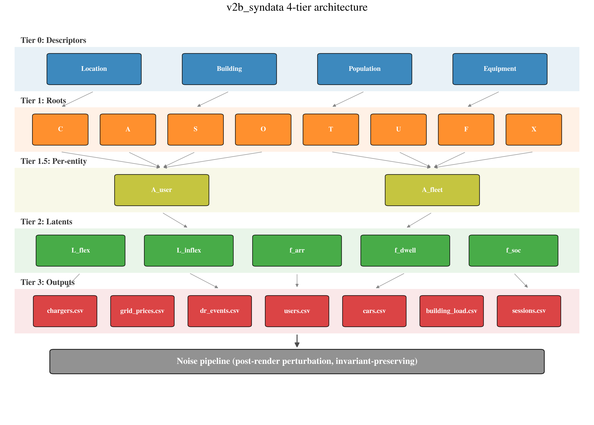

### Figure 7 — Generative DAG

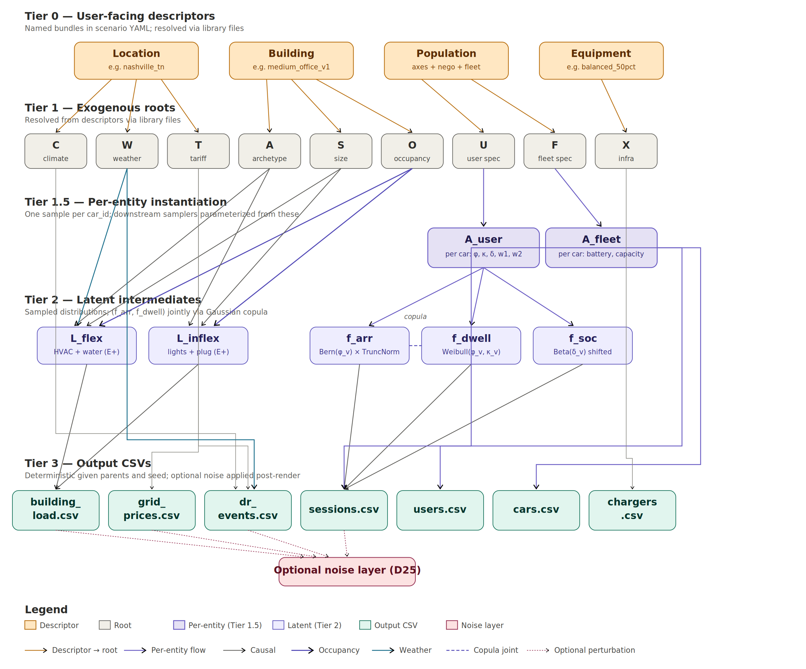

### Figure 8 — Resolution chain: one knob, end to end

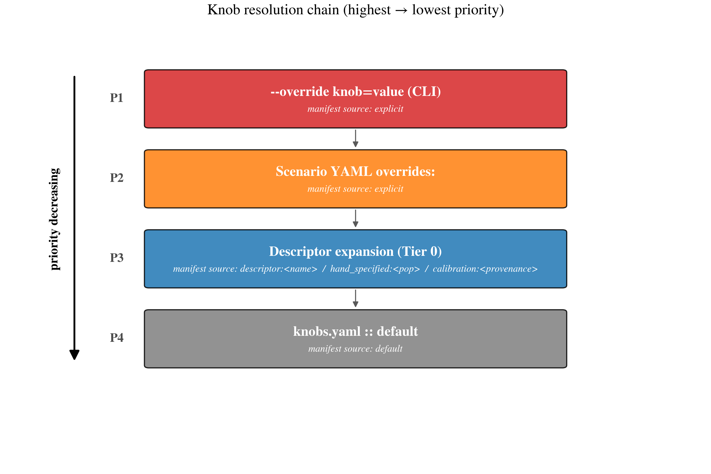

### Figure 9 — Seed lineage

Every sampler receives a derived sub-seed from the scenario seed. The lineage
is deterministic and recorded in the manifest.

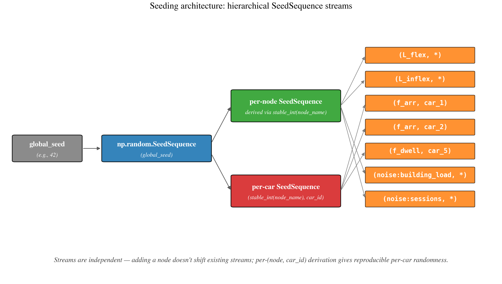

---

## 5. Data fidelity strategy

Where empirical data is available and stable, we use it. Where it isn't, we
synthesize against documented distributions and audit the result. Table 3
maps each output to its source.

### Table 3 — Data sources

| Output | Source | Why |
|---|---|---|
| building_load.csv | EnergyPlus + ASHRAE 90.1 prototypes + TMYx weather | Real building physics + real climate |
| sessions.csv | Synthetic via fitted distributions | ACN-Data calibration for workplace population |
| cars.csv | Synthetic via battery_mix simplex | No standardized fleet dataset |
| chargers.csv | Synthetic | Equipment varies per deployment |
| grid_prices.csv | Rule-based from real tariff structures | Utility tariffs are public, controllable |
| dr_events.csv | Inhomogeneous Poisson with CBP/BIP/ELRP rules | Calibrated to CAISO programs |
| users.csv | Synthetic, calibrated where ACN-Data permits | Behavioral parameters from real chargers |

### Figure 10 — Climate × season matrix

20 (location, season) cells generated end-to-end; each is a real ASHRAE
prototype run against the corresponding TMYx weather file.

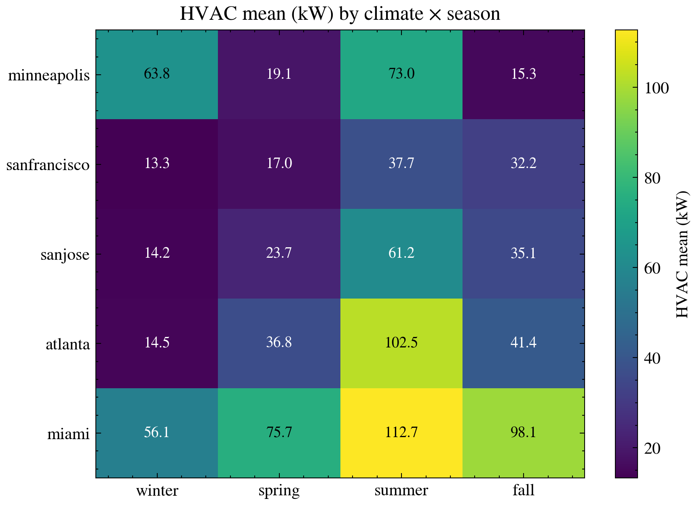

### Figure 11 — ACN-Data calibration

Where the workplace marginals are knowable from ACN-Data, we calibrate
against them. The generator reproduces the empirical arrival, duration, and
energy distributions within the documented confidence band.

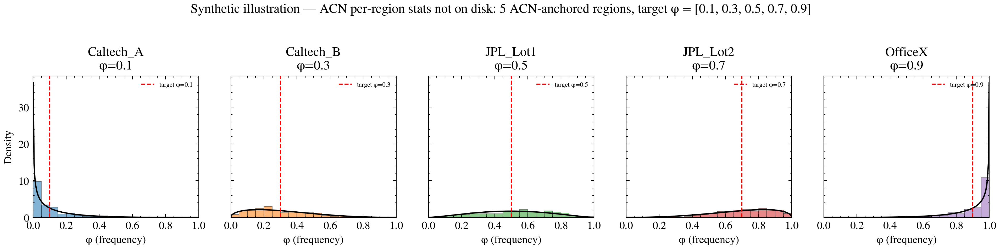

---

## 6. Scenario library

40 named scenarios cover the experiment matrix in Table 2. Figure 12 shows
the library; Figures 13 and 14 highlight the monotonicity and climate-spread
properties used downstream.

### Figure 12 — Scenario library

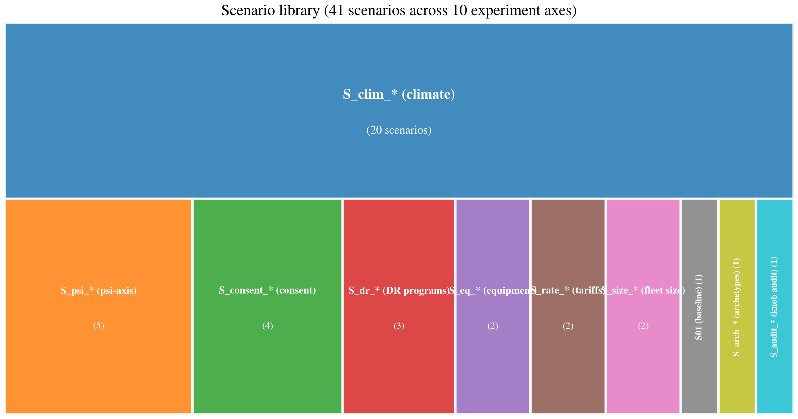

### Figure 13 — ψ-monotonicity

Sweeping the population willingness descriptor produces a monotone response
across V2B-relevant outputs.

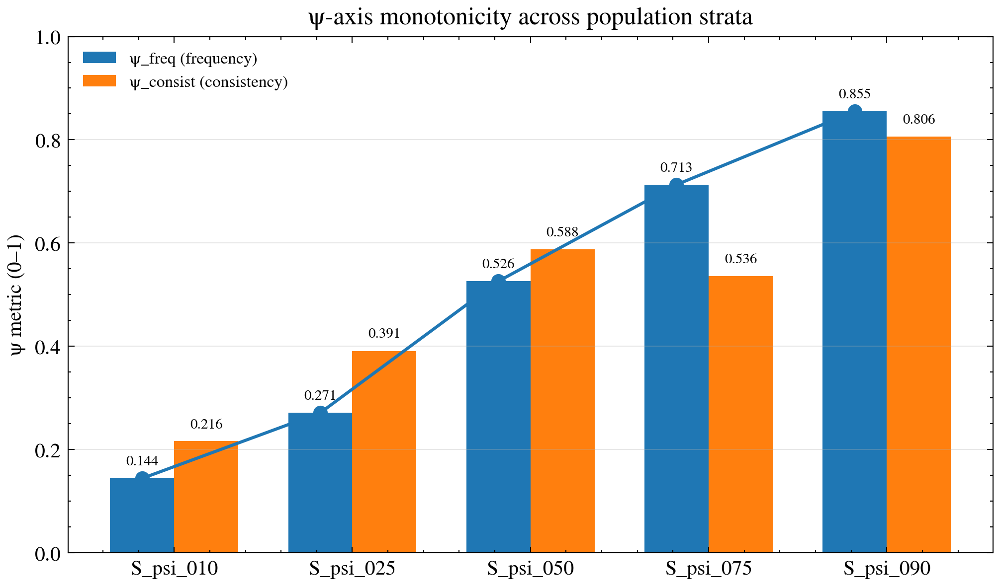

### Figure 14 — Climate divergence

Same scenario, different climates → measurably different building load,
session timing, and DR sensitivity.

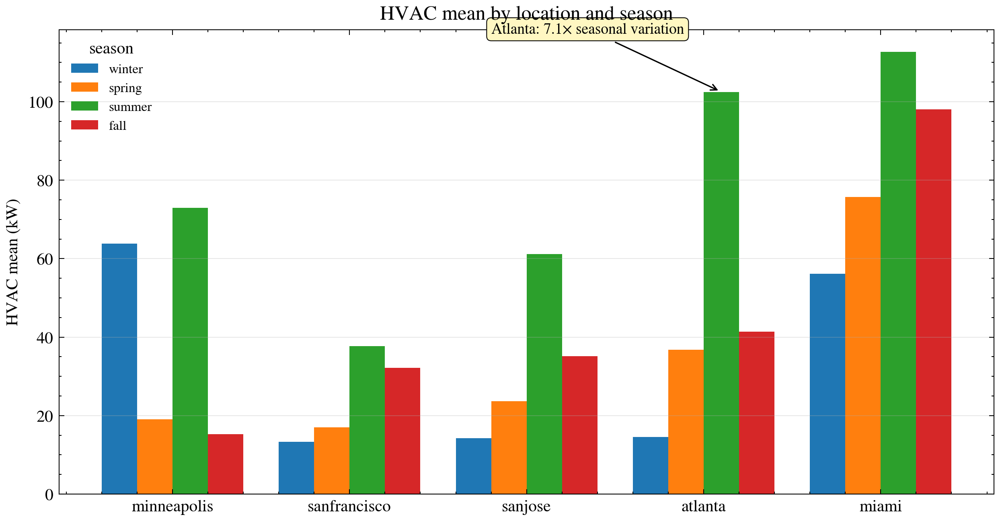

---

## 7. Verification

The generator is audited along five orthogonal axes: existence, monotonicity,
coverage, boundary behavior, and determinism. Figure 15 summarizes the
verification matrix. Tables 4 and 5 list outcomes and bugs caught.

### Figure 15 — Verification matrix

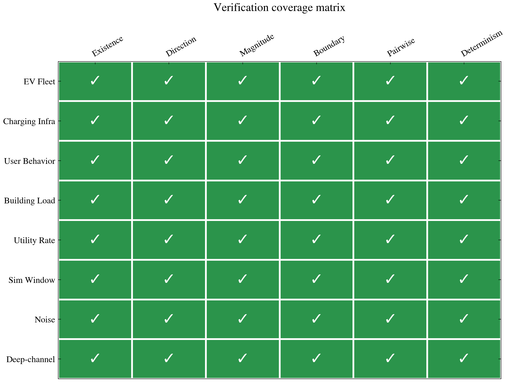

### Table 4 — Verification summary

| Stage | Tests/Probes | Result |
|---|---|---|
| Knob audit Stage 1 | 101 → 98 knobs, existence | 67 HONORED, declarations fixed |
| Knob audit Stage 2 | 67 admitted × 5 probes = 335 | 67/67 MONOTONIC, 0 wrong-direction |
| V1 Coverage | pytest --cov | 91% line coverage |
| V2 Boundary | 45 + 3 stress | All real bugs fixed |
| V2.5 Noise contract | post-jitter D5 enforcement | Implemented |
| V3 Pairwise | 50 random knob pairs | 44 linear, 0 sign-flip, 0 unexplained |
| V4 Determinism | 11 tests | 11/11 bitwise reproducible |
| **Total** | **354 unit tests + 45 calibration tests** | **All passing** |

### Table 5 — Bugs caught by verification

| # | Bug | Stage caught | Severity |
|---|---|---|---|
| 1 | chargers bidir column-value mismatch in metric | Stage 2 | Silent wrong measurement |
| 2 | noise.occupancy_jitter measured wrong CSV variance | Stage 2 | Silent wrong measurement |
| 3 | negotiation_mix metric used row_count | Stage 2 | Silent meaningless measurement |
| 4 | C4 jitter could produce arrival > departure | V2 | Invalid CSV output |
| 5 | D6 jitter could produce arrival_soc > required | V2 | Physically impossible state |
| 6 | Missing `custom` entry in noise_profiles.yaml | V3 | KeyError on profile=custom |

Plus 12 declaration corrections in `knobs.yaml`.

---

## 8. Working examples

Three scenarios are pre-generated under `data/example_scenarios/` and are
referenced throughout the notebook:

- `S01_baseline` — Nashville, mid-season, default population
- `S_clim_miami_summer` — same population, Miami / July
- `S_eq_bi` — same population/climate as baseline, bidirectional chargers

Figures 16–19 compare them. The exploration notebook
(`notebooks/exploration.ipynb`) walks through the CSVs and manifest live.

### Figure 16 — Building load profiles (one day, three scenarios)

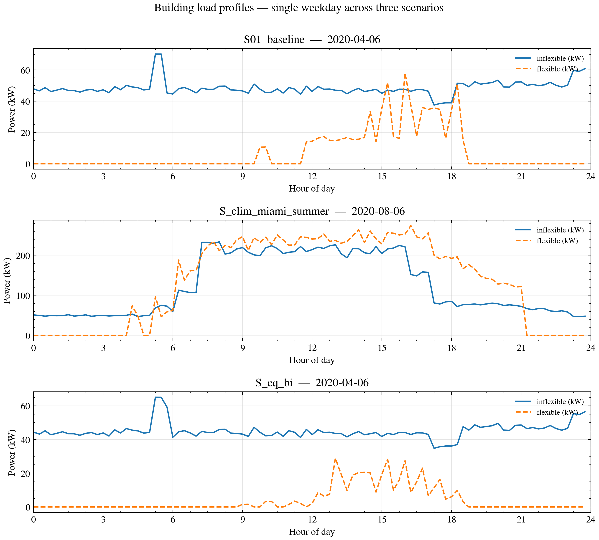

### Figure 17 — Session arrival distributions

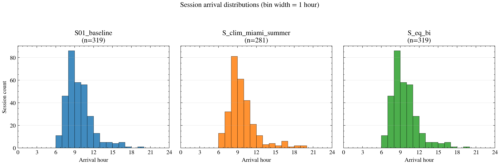

### Figure 18 — Charger mixes

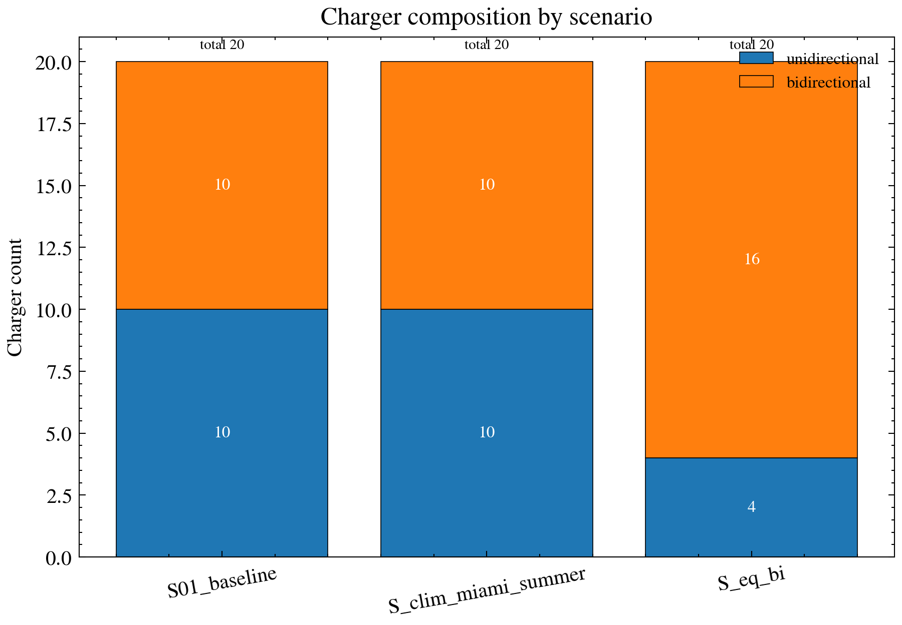

### Figure 19 — Knob differences across the three scenarios

The manifest makes the difference between scenarios explicit. Figure 19 is
the diff of resolved knob values across S01 / Miami / bidirectional.

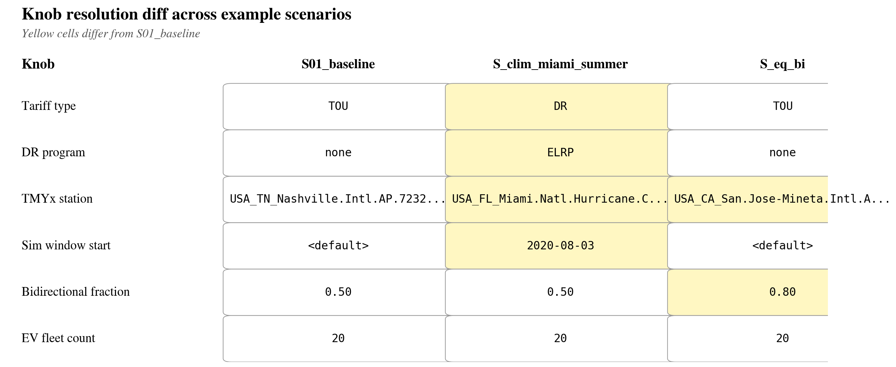

---

## 9. Scope and limits

`v2b_syndata` is a generator. Its verification is about pipeline correctness
under controlled knob movement. Real-world realism, generalization of the
ACN-Data calibration, and combinatorial multi-knob interactions are
explicitly *out of scope* for the verification harness; they are research
questions on top of the generator.

### Table 6 — Scope

| Verified | Not verified |
|---|---|
| Pipeline correctness | ACN-Data calibration generalization (research) |
| Reproducibility | Cross-platform binary identity (single-platform tested) |
| Knob effects | Multi-knob (3+) interactions (combinatorial) |
| Invariant survival under noise | Realism vs real V2B systems (research) |
| Determinism across processes | Multi-month / annual scale |
