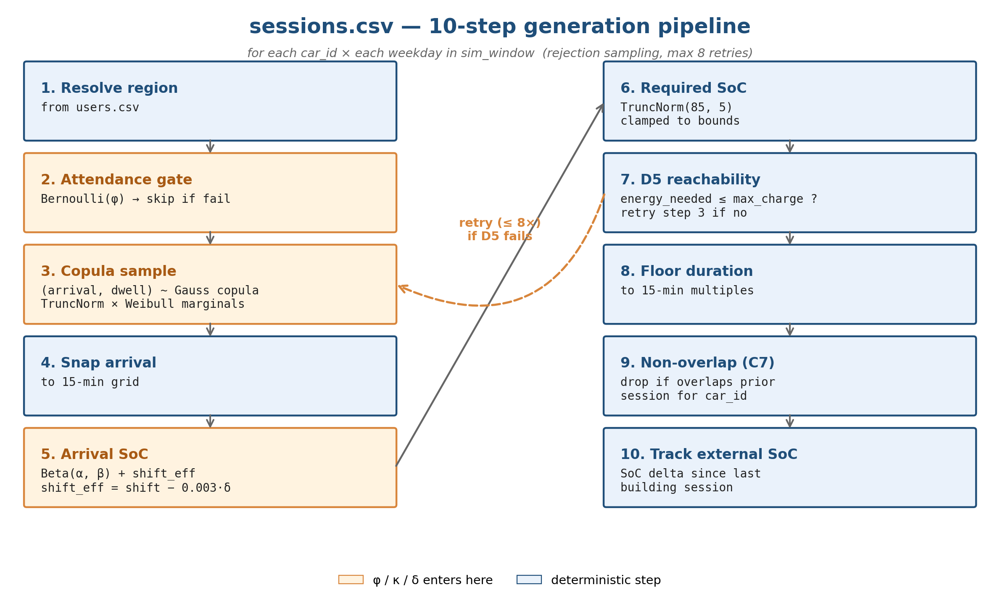
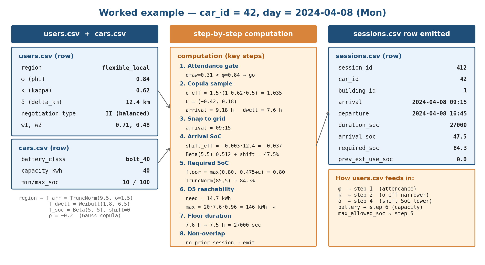

<!-- _paginate: false -->

# V2B Synthetic Data: Users, Cars, Sessions

## How three CSVs encode behavior, physics, and arrivals

 

Rishav Sen — Vanderbilt — 2026-05-20

 

Short overview — 10 slides.
For full detail: `OVERVIEW.md`, per-CSV appendix slides, `sessions.py`.

---

## The three CSVs

Generated in order: <code>users → cars → sessions</code>.
Each <code>car_id</code> gets exactly one <code>users.csv</code> + one <code>cars.csv</code> row.
Each <code>car_id</code> generates 0..N sessions across the sim window.

---

<!-- _class: dense -->

## The three behavioral axes

### φ — phi (frequency)

P(show up on any given day). `φ ∈ [0, 1]`, `φ ~ U(freq_lo, hi)`.

**Bites:** Bernoulli gate, sessions step 2. φ = 0.84 ⇒ ~84% of weekdays.

### κ — kappa (consistency)

How regular arrival timing is. `κ ∈ [0, 1]`, `κ ~ U(consist_lo, hi)`.

**Bites:** `σ_eff = σ · (1 − κ · 0.5)`. High κ ⇒ tight; low κ ⇒ spread.

### δ — delta_km (commute)

One-way commute distance. `δ ∈ [3, 100]` km, `δ ~ U(dist_lo, hi)`.

**Bites:** `shift_eff = shift − 0.003·δ`. Longer commute ⇒ lower arrival SoC.

---

## Region grid (5 default regions)

Each car is assigned one region, which fixes its (φ, κ, δ) bounds.

| Region | φ range | κ range | δ range (km) | Weight | Mental model |
|---|---|---|---|---|---|
| stable_commuter    | [0.85, 1.00] | [0.75, 1.00] | [40, 80]  | 0.35 | Long-distance office, daily |
| flexible_local     | [0.70, 0.95] | [0.50, 0.80] | [5, 15]   | 0.25 | Local, frequent + flexible |
| irregular_distant  | [0.40, 0.70] | [0.20, 0.50] | [40, 100] | 0.20 | Long commute, ~3 days/wk |
| occasional_visitor | [0.05, 0.20] | [0.10, 0.40] | [3, 50]   | 0.10 | Rare drop-in |
| erratic            | [0.30, 0.70] | [0.05, 0.30] | [5, 80]   | 0.10 | Unpredictable schedule |

Region weights themselves can be Dirichlet-perturbed per sample (knob: <code>axes_distribution_dirichlet_alpha</code>).

---

<!-- _class: dense -->

## `users.csv` generation

For each `car_id ∈ [1, ev_count]`:

1. **(opt.) Dirichlet perturb region weights** — if `α < 1e6`, `realized_weights ~ Dirichlet(weights · α)`.
2. **Assign region** — `region ~ Categorical(realized_weights)`.
3. **Sample axes** — `φ ~ U(freq_lo, hi)`, `κ ~ U(consist_lo, hi)`, `δ ~ U(dist_km_lo, hi)`.
4. **Negotiation type** — `Categorical(negotiation_mix)`; 4 CONSENT clusters (I/II/III/IV).
5. **CONSENT weights** — `(w1, w2) ~ N(cluster_μ, cluster_σ)`, clipped ≥ 0, × `w_multiplier`. *(used for downstream negotiation)*

**Schema:** `car_id, region, phi, kappa, delta_km, negotiation_type, w1, w2`

---

<!-- _class: dense -->

## `cars.csv` generation

Branch on `battery_heterogeneity`:

### `homog`

all cars = `argmax(battery_mix)`. Dirichlet ignored.

### `mixed`, α ≥ 1e6  *(default)*

per car: `battery_class ~ Categorical(battery_mix)`

### `mixed`, α < 1e6

once/sample: `realized_mix ~ Dirichlet(battery_mix · α)`; per car: `Categorical(realized_mix)`

Then lookup `BATTERY_SPECS[battery_class]` → `capacity_kwh ∈ {24, 40, 75, 100}` and SoC bounds (typ. `[10%, 100%]`).

**Schema:** `car_id, capacity_kwh, min_allowed_soc, max_allowed_soc, battery_class`

---

<!-- _class: dense -->

## `sessions.csv` pipeline (10 steps)

<b>Step 3 model:</b> bivariate <b>Gaussian copula</b> on <code>(arrival_hour, dwell_hours)</code> — marginals <code>TruncNorm(μ, σ)</code> × <code>Weibull(k, λ)</code>; ρ per region (typ. negative ⇒ early arrivers stay longer).
Rejection sampling: D5-fail car-days retry ≤ 8x then drop.

---

<!-- _class: dense -->

## Worked example

car_id=42, day=2024-04-08 — full numerical trace; same numbers reproduced in the .docx.

---

<!-- _class: dense -->

## Knob cheat sheet

| Bucket | Knob | Effect |
|---|---|---|
| ev_fleet | `ev_count`; `battery_mix`; `battery_heterogeneity`; `battery_mix_dirichlet_alpha` | Fleet size + battery class branch & mix |
| user_behavior | `axes_distribution`; `axes_distribution_dirichlet_alpha` | 5-region grid: (φ, κ, δ) bounds + weight perturbation |
| user_behavior | `negotiation_mix`; `w_multiplier` | CONSENT cluster mix + (w1, w2) scale |
| user_behavior | `min_depart_soc` | Floor on `required_soc_at_depart` |
| user_behavior | `region_distributions.<r>.<dist>.<param>` | Deep override of any region's f_arr / f_dwell / f_soc / ρ |
| charging_infra | `charger_count`; `*_rate_kw`; `directionality_frac` | Gate D5 reachability check |
| sim_window | `mode`; `weekdays_only`; `start`; `custom_end` | Day loop in sessions.py |
| noise | `arrival_time_jitter_min`; `soc_arrival_jitter_pct`; `profile` | Post-render jitter; `tmyx_stochastic` ⇒ ±5 min, ±3% |

---

## Where to go deeper

This deck is the short version. For more:

- **`walkthrough.html`** — interactive page: drag sliders (φ, κ, δ, ρ, Dirichlet α, CONSENT cluster) and see distributions update live
- **`OVERVIEW.md`** — full architecture, all 7 CSVs, manifest, descriptor model
- **Per-CSV appendix slides** — every CSV's full pipeline (slides A9–A15 in the long deck)
- **`src/v2b_syndata/renderers/sessions.py`** — implementation
- **`configs/populations.yaml`** — per-region distribution parameters
- **`KNOB_REFERENCE.md`** — every knob, with audit notes

 

Questions?

