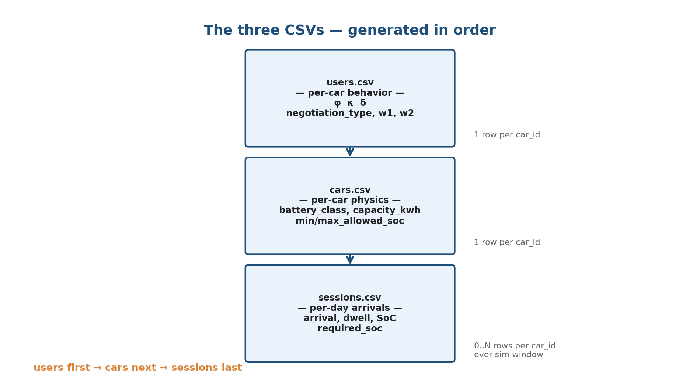

# V2B Synthetic Data — Users, Cars, Sessions Generation

*How three CSVs encode user behavior, fleet physics, and per-day arrivals*

---

## 1. The three CSVs

`users.csv`, `cars.csv`, and `sessions.csv` form a causal chain. They are
generated **in this order**: users first, then cars, then sessions. Each row
in `users.csv` corresponds 1:1 with a row in `cars.csv` (same `car_id`). Each
`car_id` produces 0..N sessions across the simulation window.

## 2. The three behavioral axes

Each car gets three continuous behavioral parameters that define how it
behaves during simulation.

| Axis | Meaning | Range | Where it bites |
|---|---|---|---|
| **φ** (phi) — frequency | Probability of showing up on any given day | [0.0, 1.0] | Bernoulli gate in sessions step 2 |
| **κ** (kappa) — consistency | How regular the arrival timing is | [0.0, 1.0] | `σ_eff = σ · (1 − κ · 0.5)` in step 3 |
| **δ** (delta_km) — commute | One-way commute distance proxy | [3, 100] km | `shift_eff = shift − 0.003 · δ` in step 5 |

## 3. Default region grid (consent_default)

Each car is assigned one of 5 regions, which fixes its (φ, κ, δ) bounds.

| Region | φ range | κ range | δ range (km) | Weight | Mental model |
|---|---|---|---|---|---|
| stable_commuter   | [0.85, 1.00] | [0.75, 1.00] | [40, 80]  | 0.35 | Long-distance office, daily |
| flexible_local    | [0.70, 0.95] | [0.50, 0.80] | [5, 15]   | 0.25 | Local, frequent + flexible |
| irregular_distant | [0.40, 0.70] | [0.20, 0.50] | [40, 100] | 0.20 | Long commute, ~3 days/week |
| occasional_visitor| [0.05, 0.20] | [0.10, 0.40] | [3, 50]   | 0.10 | Rare drop-in |
| erratic           | [0.30, 0.70] | [0.05, 0.30] | [5, 80]   | 0.10 | Unpredictable schedule |

---

## 4. users.csv generation

For each `car_id ∈ [1, ev_count]`:

1. **(Optional) Perturb region weights via Dirichlet.** If
   `axes_distribution_dirichlet_alpha < 1e6`:
   `realized_weights ~ Dirichlet(weights · α)`. Else: declared weights
   verbatim. Logged to manifest under `realized_distributions`.
2. **Assign region:** `region ~ Categorical(realized_weights)`.
3. **Sample axes (independent in 3D box):**
   `φ ~ Uniform(freq_lo, freq_hi)`,
   `κ ~ Uniform(consist_lo, consist_hi)`,
   `δ ~ Uniform(dist_km_lo, dist_km_hi)`.
4. **Assign negotiation type** from CONSENT clusters (I assertive,
   II balanced, III accommodating, IV deferential):
   `negotiation_type ~ Categorical(negotiation_mix)`.
5. **Sample CONSENT weights:** lookup `(cluster_μ, cluster_σ)`,
   `(w1, w2) ~ Normal(cluster_μ, cluster_σ)`, clipped ≥ 0,
   scaled by `w_multiplier`.

**Schema:** `car_id, region, phi, kappa, delta_km, negotiation_type, w1, w2`.

## 5. cars.csv generation

For each `car_id`:

1. **Branch by `battery_heterogeneity`:**
   - `homog`: all cars get `argmax(battery_mix)`.
   - `mixed`, `α ≥ 1e6` (default): per car `battery_class ~ Categorical(battery_mix)`.
   - `mixed`, `α < 1e6`: once per sample
     `realized_mix ~ Dirichlet(battery_mix · α)`, then per car
     `battery_class ~ Categorical(realized_mix)`.
2. **Lookup `BATTERY_SPECS[battery_class]`** for
   `capacity_kwh ∈ {24, 40, 75, 100}` and SoC bounds.

**Schema:** `car_id, capacity_kwh, min_allowed_soc, max_allowed_soc, battery_class`.

## 6. sessions.csv generation (10 steps)

For each `car_id` and each weekday in `sim_window` (rejection sampling,
max 8 retries):

1. **Resolve car's region** from `users.csv`.
2. **Attendance gate:** `draw ~ U(0,1)`; if `draw > φ`, skip day.
3. **Sample arrival × dwell jointly — bivariate Gaussian copula on
   `(arrival_hour, dwell_hours)`.** Marginals: `arrival_hour ~ TruncNorm(μ_r, σ_eff; [lo, hi])`,
   `dwell_hours ~ Weibull(k_r, λ_r)`. Departure = arrival + dwell, so the
   copula governs `(arrival, departure)` indirectly.
   `(u_arr, u_dwell) ~ N₂(0, [[1, ρ_r], [ρ_r, 1]])`;
   `σ_eff = σ_region · (1 − κ · 0.5)`;
   `arrival_hour ← TruncNorm(μ_r, σ_eff).ppf(Φ(u_arr))`;
   `dwell_hours ← Weibull(k_r, λ_r).ppf(Φ(u_dwell))`.
   `ρ_r = region.copula.rho_gaussian` is typically negative
   (e.g. flexible_local: ρ = −0.2 ⇒ early arrivers stay longer).
4. **Snap arrival to 15-min grid.**
5. **Sample arrival SoC:**
   `shift_eff = shift_r − 0.003 · δ`;
   `arrival_soc ~ Beta(α_r, β_r) + shift_eff`.
6. **Sample required SoC at departure:**
   `required_soc ~ TruncNorm(85, 5)`, clamped to
   `[max(min_depart_soc, arrival_soc + ε), max_allowed_soc]`.
7. **D5 reachability check:**
   `energy_needed = (required_soc − arrival_soc)/100 · capacity_kwh`;
   `max_charge = best_charger.max_rate_kw · dwell_hours · 0.96`;
   discard & retry if `energy_needed > max_charge`.
8. **Floor duration** to 15-min multiples.
9. **Per-car non-overlap (C7):** drop if overlaps a prior session today.
10. **Track previous_day_external_use_soc:** SoC delta from external
    charging since last building session.

**Schema:** `session_id, car_id, building_id, arrival, departure,
duration_sec, arrival_soc, required_soc_at_depart,
previous_day_external_use_soc`.

## 7. Worked example

> **car_id = 42**, day = 2024-04-08 (Mon).
>
> *users.csv row:* `region=flexible_local`, φ=0.84, κ=0.62, δ=12.4 km,
> `negotiation_type=II`, `w1=0.71, w2=0.48`.
> *cars.csv row:* `battery_class=bolt_40`, `capacity_kwh=40`,
> `min/max_allowed_soc=10/100`.
>
> *region distributions:*
> `f_arr=TruncNorm(μ=9.5, σ=1.5)`,
> `f_dwell=Weibull(1.8, 6.5)`,
> `f_soc=Beta(5, 5)`, `shift_region=0`, `ρ=−0.2`.
>
> 1. Attendance: `draw=0.31 < 0.84` → continue.
> 2. Copula: `σ_eff = 1.5·(1−0.62·0.5) = 1.035`;
>    `(u_arr, u_dwell) = (−0.42, 0.18)`;
>    `arrival_hour = 9.18`, `dwell = 7.6 h`.
> 3. Snap: `arrival = 09:15`.
> 4. Arrival SoC: `shift_eff = −0.003·12.4 = −0.037`;
>    `Beta(5,5) = 0.512` → `+ shift = 0.475` → **47.5%**.
> 5. Required SoC: floor `= max(0.80, 0.475+ε) = 0.80`;
>    `TruncNorm(85,5)` → **84.3%**.
> 6. D5: need `(84.3−47.5)/100·40 = 14.7 kWh`;
>    max `= 20·7.6·0.96 = 146 kWh`. ✓
> 7. Floor: `7.6 h → 7.5 h = 27000 sec`.
>
> **sessions.csv row:** `session_id=412`, `car_id=42`,
> `arrival=2024-04-08 09:15`, `departure=2024-04-08 16:45`,
> `duration_sec=27000`, `arrival_soc=47.5`,
> `required_soc_at_depart=84.3`, `previous_day_external_use_soc=0.0`.

## 8. Knob cheat sheet

| Bucket | Knob | Effect |
|---|---|---|
| ev_fleet | `ev_count` | # car_ids in users.csv and cars.csv |
| ev_fleet | `battery_mix` | Simplex over leaf_24/bolt_40/m3_75/rivian_100 |
| ev_fleet | `battery_heterogeneity` | homog vs. mixed branch in cars.py |
| ev_fleet | `battery_mix_dirichlet_alpha` | Per-sample mix perturbation (1e6 = off) |
| user_behavior | `axes_distribution` | 5-region grid; defines (φ, κ, δ) bounds + weight |
| user_behavior | `negotiation_mix` | CONSENT cluster distribution |
| user_behavior | `w_multiplier` | Scales (w1, w2) |
| user_behavior | `min_depart_soc` | Floor on `required_soc_at_depart` |
| user_behavior | `axes_distribution_dirichlet_alpha` | Per-sample region-weight perturbation |
| user_behavior | `region_distributions.<r>.<dist>.<param>` | Deep override of region's f_arr/f_dwell/f_soc |
| charging_infra | `charger_count`, `directionality_frac`, `uni_rate_kw`, `bi_rate_kw` | Gate D5 reachability check |
| sim_window | `mode`, `weekdays_only`, `start`, `custom_end` | Day loop in sessions.py |
| noise | `arrival_time_jitter_min` | Post-render jitter on arrival |
| noise | `soc_arrival_jitter_pct` | Post-render jitter on arrival_soc |
| noise | `profile` | Selects preset; `tmyx_stochastic` (default) = ±5 min, ±3% |
