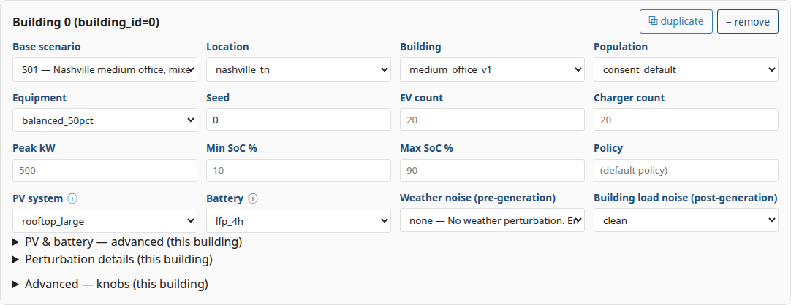
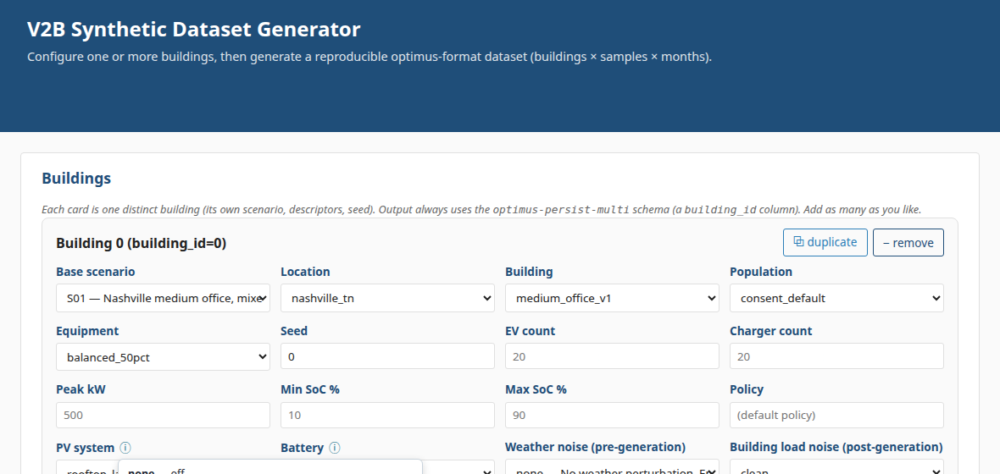
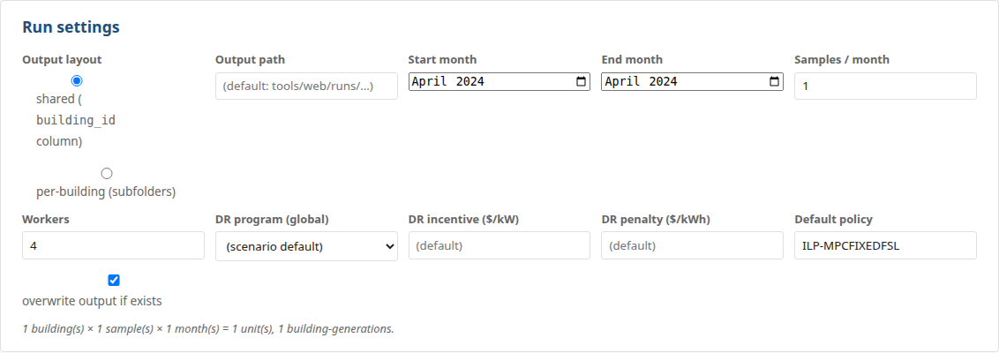
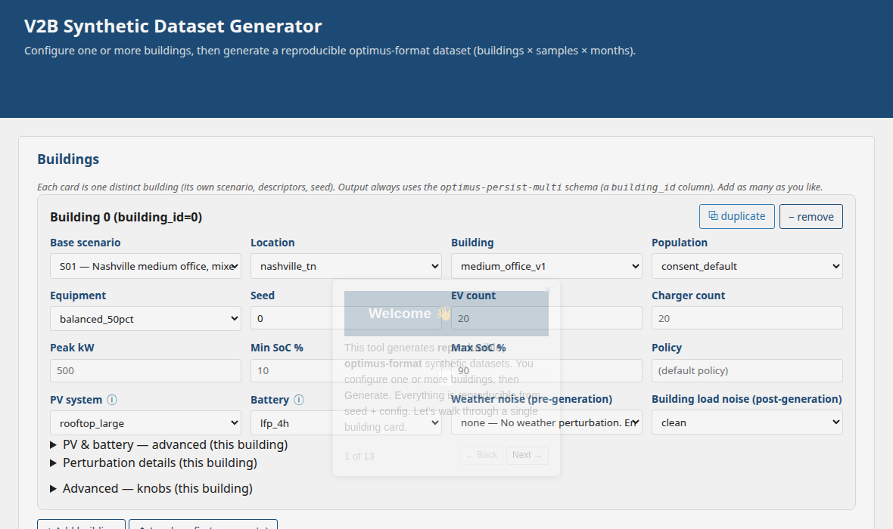

# Web Interface — Overview

A visual walkthrough of the **V2B Synthetic Dataset Generator** web tool: a
point-and-click front end for producing reproducible, optimus-format synthetic
datasets (buildings × samples × months) without touching the CLI.

> **Prefer to learn in-app?** Launch the tool and click **▶ Take a tour** in the
> header for an interactive, step-by-step guided tour of everything below.

## Launch it

```bash
uv run python tools/web/app.py
# → http://127.0.0.1:5000
```

## The mental model

- **One card = one building.** Each card fully defines a single building — its
  scenario, EV fleet, building load, and distributed energy resources (PV +
  battery). Add as many cards as you like.
- **Output is always multi-building** (optimus `optimus-persist-multi` schema,
  with a `building_id` column).
- **Everything is reproducible** from `seed + config`. A run writes a
  `multi_building_config.json` you can re-load to regenerate it byte-for-byte.

---

## A building card, section by section



**1. Scenario & descriptors.** Start from a named **Base scenario** (e.g.
`S01`); the **Location / Building / Population / Equipment** selectors override
its descriptors for this building.

**2. Quick fields.** The most common knobs as direct inputs — **EV count**,
**Charger count**, **Peak kW**, **Min/Max SoC**, **Seed**, **Policy**. Leave a
field blank to use the scenario's resolved default (shown as the placeholder).

**3. PV system & Battery.** Add distributed energy resources per building:



- **PV system** — pick a rooftop/carport preset (`none` = off). The **ⓘ** button
  lists what each option means, sorted by size (e.g. `rooftop_small — 30 kW`,
  `rooftop_xl — 600 kW`). Choosing a preset turns PV on, sizes the array, and
  fills the advanced PV dials. Its generation curve is computed from the **same
  weather** EnergyPlus uses for the building load.
- **Battery** — pick a preset (LFP / NMC, 2 h or 4 h); the **ⓘ** explains each.
  Specs only (capacity / power / efficiency / SoC window) — no dispatch schedule.

**4. PV & battery — advanced** (collapsible). Fine-tune the selected system:
explicit kW, tilt / azimuth, module type, system derate; battery capacity /
power / efficiency / SoC window. Picking a preset above pre-fills these.

**5. Perturbation details** (collapsible). Per-building **weather noise**
(pre-generation — shifts the simulated & exported weather) and **building-load
noise** (post-generation jitter on the produced CSVs).

**6. Advanced — knobs** (collapsible). Every remaining `configs/knobs.yaml`
knob, scoped to this building, with its resolved value and source.

### Multiple buildings

- **+ Add building** — a new, independent card (its seed auto-increments).
- **⧉ Duplicate** — copy a card with a fresh seed.
- **⬆ Load config (regenerate)** — re-load a prior run's
  `multi_building_config.json` to reproduce it exactly.

---

## Run settings



How much to generate and where: **output layout** (shared `building_id` column
vs per-building subfolders), **output path**, **start/end month**,
**samples / month**, **workers**, and a **global DR program** (with
incentive/penalty) applied to every building.

## Generate

Click **Generate**. The backend runs generation for each building — EnergyPlus
building load + sampled charging sessions + DER — and writes the optimus CSVs.
Progress is shown live; the run is reproducible from `seed + config`.

## Results — Distributions & profiles

After a run, the **Output** section appears with an interactive analysis panel.
Pick a **CSV**, a **feature**, and an **aggregation**, then **Plot**:

- **Time-series CSVs** (`building_load`, `pv_generation`, `weather_data`,
  `grid_prices`) support a **daily profile** (mean ±1σ across the month) or the
  **full monthly series**.
- **`pv_generation`** plots `power_pv_kw` / `energy_kwh_pv` exactly like building
  load — handy to see solar generation against the gross load.
- **Distribution CSVs** (`sessions`, `cars`) plot as box / violin / histogram.

Plots are per-building (each `building_id` is a separate trace).

---

## Guided tour

The **▶ Take a tour** button walks you through a live card with step-by-step
callouts — the fastest way to learn the layout.



---

## Good to know

- **Reproducibility:** same `seed + config` → byte-identical output. The `clean`
  noise profile makes the building load a deterministic `f(weather)`.
- **CLI equivalent:** every control is a knob; the same run is reproducible with
  `v2b-syndata generate-multi --config <the saved JSON>`, and any knob is
  settable with `--override bucket.knob=value` (see `docs/KNOB_REFERENCE.md`).
- **How the models work:** `docs/GENERATIVE_MODELS.md` (why each distribution /
  the PVWatts model); `docs/CALIBRATION_NOTES.md` (how the real-data fits run).
